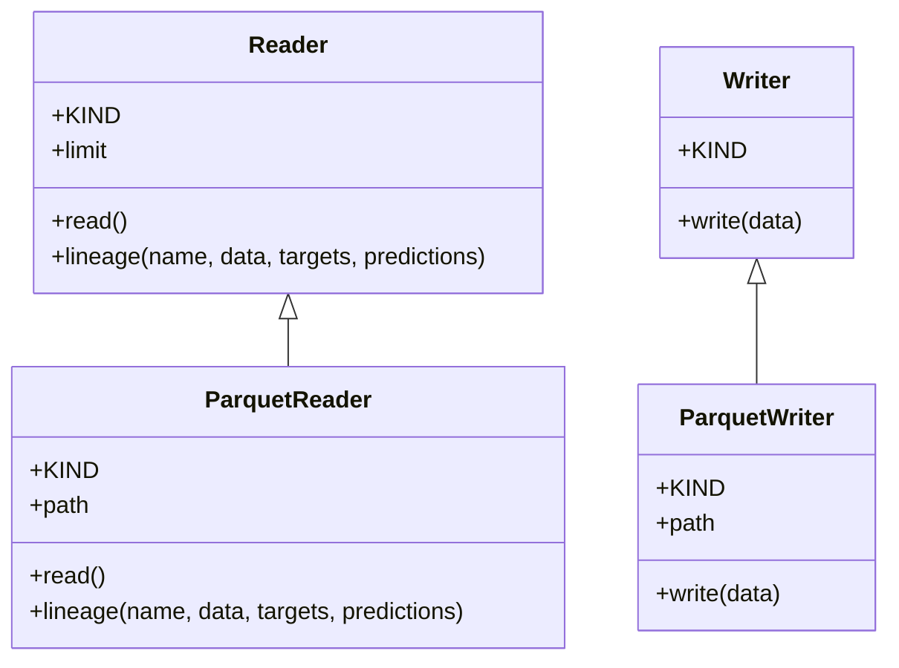
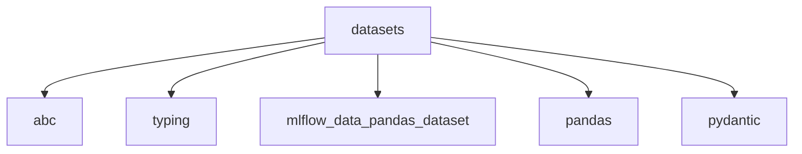

# datasets

Source File: `src/regression_model_template/io/datasets.py`

Read/Write datasets from/to external sources/destinations.

```mermaid
classDiagram
    class Reader {
        +KIND
        +limit
        +read()
        +lineage(name, data, targets, predictions)
    }
    Reader <|-- ParquetReader
    class ParquetReader {
        +KIND
        +path
        +read()
        +lineage(name, data, targets, predictions)
    }
    class Writer {
        +KIND
        +write(data)
    }
    Writer <|-- ParquetWriter
    class ParquetWriter {
        +KIND
        +path
        +write(data)
    }
```

```mermaid
flowchart TD
    datasets --> abc
    datasets --> typing
    datasets --> mlflow_data_pandas_dataset
    datasets --> pandas
    datasets --> pydantic
```
