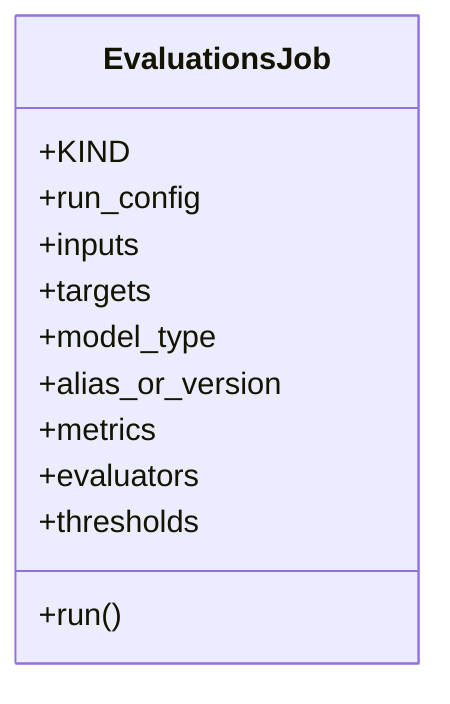
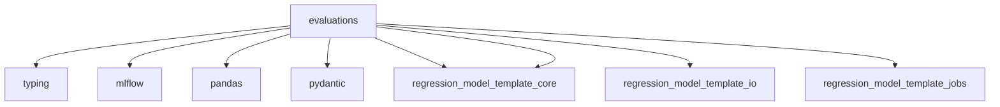

# evaluations

Source File: `src/regression_model_template/jobs/evaluations.py`

Define a job for evaluating registered models with data.

```mermaid
classDiagram
    class EvaluationsJob {
        +KIND
        +run_config
        +inputs
        +targets
        +model_type
        +alias_or_version
        +metrics
        +evaluators
        +thresholds
        +run()
    }
```

```mermaid
flowchart TD
    evaluations --> typing
    evaluations --> mlflow
    evaluations --> pandas
    evaluations --> pydantic
    evaluations --> regression_model_template_core
    evaluations --> regression_model_template_core
    evaluations --> regression_model_template_io
    evaluations --> regression_model_template_jobs
```
