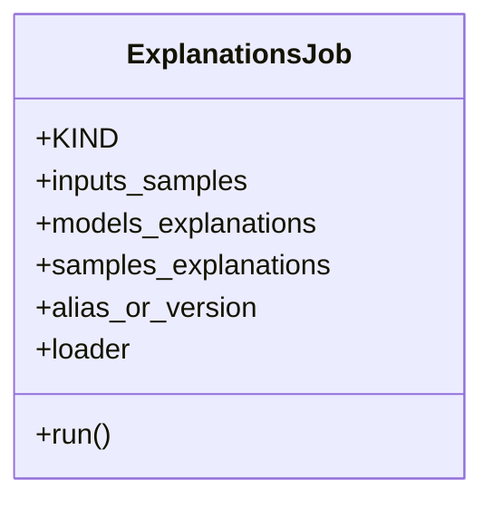
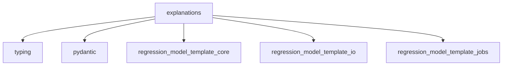

# explanations

Source File: `src/regression_model_template/jobs/explanations.py`

Define a job for explaining the model structure and decisions.

```mermaid
classDiagram
    class ExplanationsJob {
        +KIND
        +inputs_samples
        +models_explanations
        +samples_explanations
        +alias_or_version
        +loader
        +run()
    }
```

```mermaid
flowchart TD
    explanations --> typing
    explanations --> pydantic
    explanations --> regression_model_template_core
    explanations --> regression_model_template_io
    explanations --> regression_model_template_jobs
```
