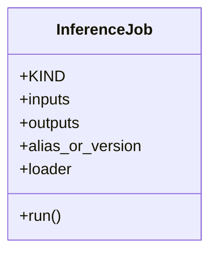
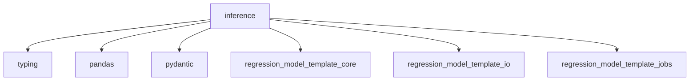

# inference

Source File: `src/regression_model_template/jobs/inference.py`

Define a job for generating batch predictions from a registered model.

```mermaid
classDiagram
    class InferenceJob {
        +KIND
        +inputs
        +outputs
        +alias_or_version
        +loader
        +run()
    }
```

```mermaid
flowchart TD
    inference --> typing
    inference --> pandas
    inference --> pydantic
    inference --> regression_model_template_core
    inference --> regression_model_template_io
    inference --> regression_model_template_jobs
```
