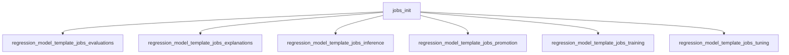

# jobs_init

Source File: `src/regression_model_template/jobs/__init__.py`

High-level jobs of the project.

```mermaid
flowchart TD

    jobs_init --> regression_model_template_jobs_evaluations
    jobs_init --> regression_model_template_jobs_explanations
    jobs_init --> regression_model_template_jobs_inference
    jobs_init --> regression_model_template_jobs_promotion
    jobs_init --> regression_model_template_jobs_training
    jobs_init --> regression_model_template_jobs_tuning
```
