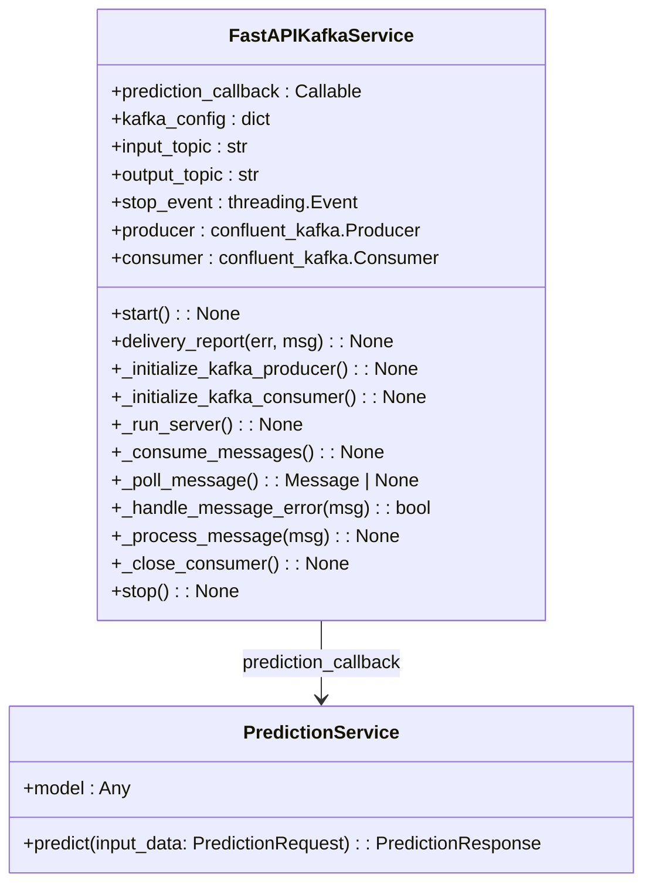
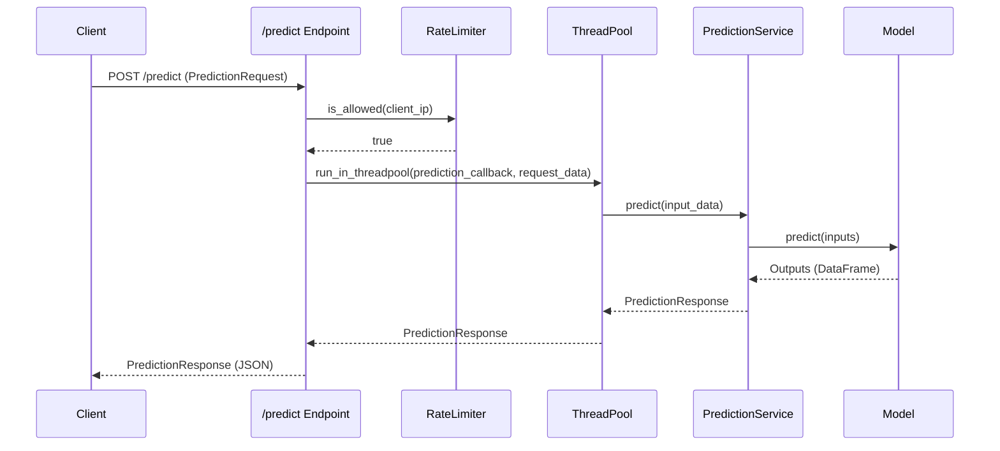

# kafka_app

Source File: `src/regression_model_template/controller/kafka_app.py`

FastAPI and Kafka Service for Predictions with Logging.





```mermaid
flowchart TD
    subgraph Kafka Streaming Flow
        A[Kafka Topic: Input] -->|Poll Message| B(FastAPIKafkaService._consume_messages)
        B --> C{msg.error()?}
        C -- Yes --> D(_handle_message_error)
        C -- No --> E(_process_message)
        E --> F[Parse JSON & Validate PredictionRequest]
        F --> G[prediction_callback: PredictionService.predict]
        G --> H[Kafka Producer: produce]
        H --> I[Kafka Topic: Output]
        H --> J[Commit Offset asynchronously]
    end
```
