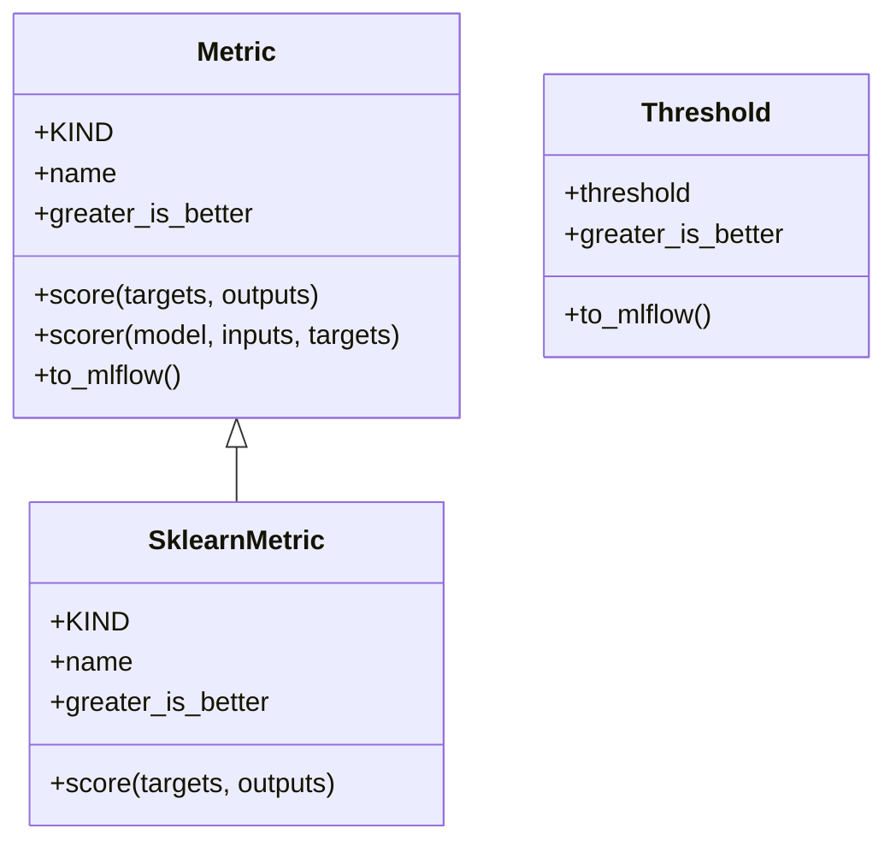
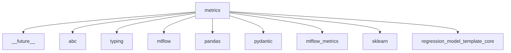

# metrics

Source File: `src/regression_model_template/core/metrics.py`

Evaluate model performances with metrics.

```mermaid
classDiagram
    class Metric {
        +KIND
        +name
        +greater_is_better
        +score(targets, outputs)
        +scorer(model, inputs, targets)
        +to_mlflow()
    }
    Metric <|-- SklearnMetric
    class SklearnMetric {
        +KIND
        +name
        +greater_is_better
        +score(targets, outputs)
    }
    class Threshold {
        +threshold
        +greater_is_better
        +to_mlflow()
    }
```

```mermaid
flowchart TD
    metrics --> __future__
    metrics --> abc
    metrics --> typing
    metrics --> mlflow
    metrics --> pandas
    metrics --> pydantic
    metrics --> mlflow_metrics
    metrics --> sklearn
    metrics --> regression_model_template_core
```
