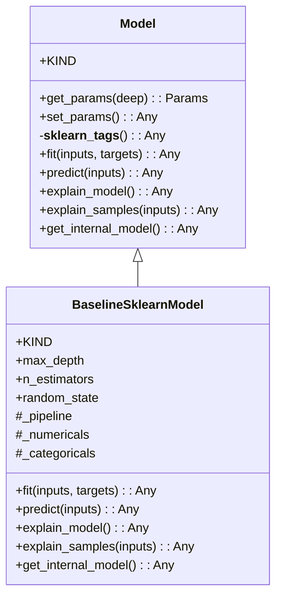
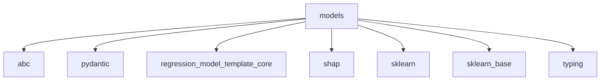

# models

Source File: `src/regression_model_template/core/models.py`

Define trainable machine learning models.

```mermaid
classDiagram
    class Model {
        +KIND
        +get_params(deep) : Params
        +set_params() : Any
        -__sklearn_tags__() : Any
        +fit(inputs, targets) : Any
        +predict(inputs) : Any
        +explain_model() : Any
        +explain_samples(inputs) : Any
        +get_internal_model() : Any
    }
    class BaselineSklearnModel {
        +KIND
        +max_depth
        +n_estimators
        +random_state
        #_pipeline
        #_numericals
        #_categoricals
        +fit(inputs, targets) : Any
        +predict(inputs) : Any
        +explain_model() : Any
        +explain_samples(inputs) : Any
        +get_internal_model() : Any
    }
    Model <|-- BaselineSklearnModel
```

```mermaid
flowchart TD

    models --> abc
    models --> pydantic
    models --> regression_model_template_core
    models --> shap
    models --> sklearn
    models --> sklearn_base
    models --> typing
```
