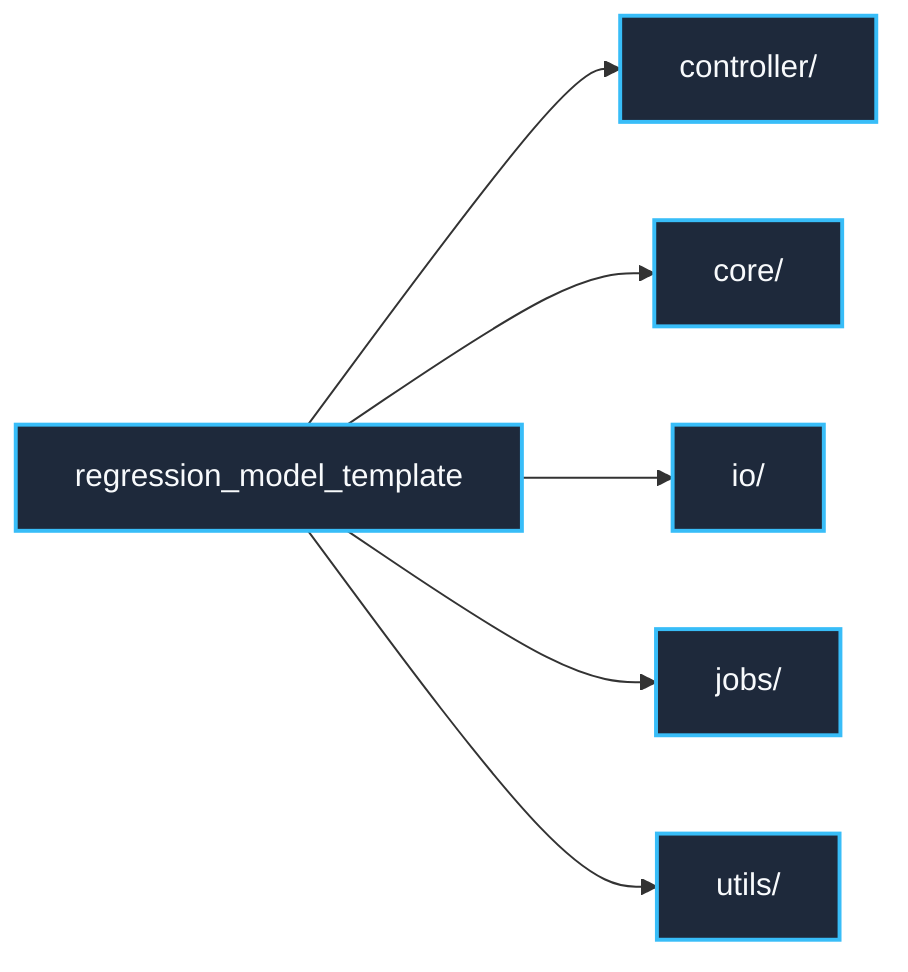

# regression_model_template::__init__ — Package Metadata

> **Source**: `src/regression_model_template/__init__.py` (Lines: L1-L1)  
> **Layer**: Application Root  
> **Role**: Package root marker and version namespace definition.

---

## 1. Architectural Scope

Defines the primary import namespace for the `regression_model_template` package. Exposes top-level package metadata and version attributes.

---

> *Related: [Strategic Design](../../architecture/strategic_design.md) · [Master Index](../../index.md)*
