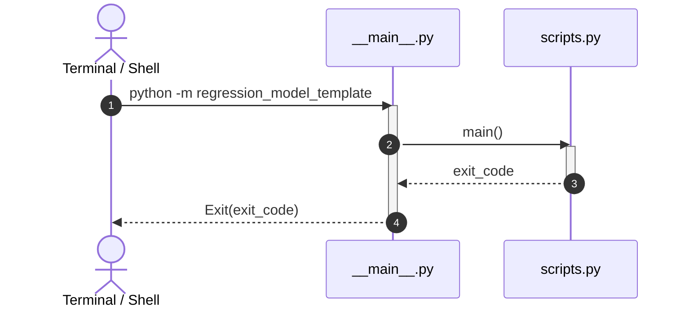

# regression_model_template::__main__ — CLI Entrypoint

> **Source**: `src/regression_model_template/__main__.py` (Lines: L1-L10)  
> **Layer**: Interface  
> **Role**: Command-line entrypoint executing `scripts.main()` upon invocation.

---

## 1. Execution Flow

Delegates standard shell command execution (`python -m regression_model_template`) to `scripts.main`:

---

> *Related: [Scripts Specification](scripts.md) · [User Manual](../../operations/user_manual.md)*
