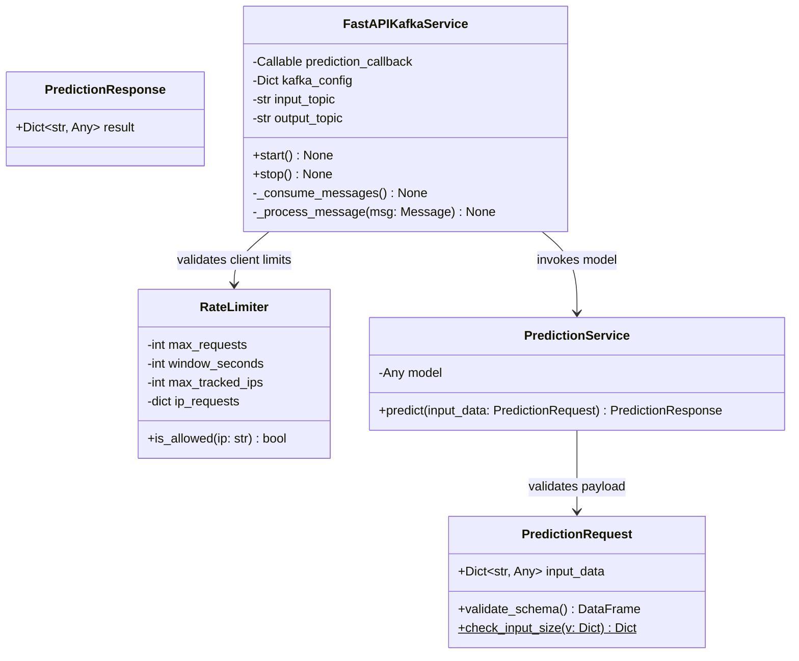

# regression_model_template::controller::kafka_app — Streaming & REST Prediction Service

> **Source**: `src/regression_model_template/controller/kafka_app.py` (Lines: L1-L501)  
> **Layer**: Interface / Streaming  
> **Role**: Dual-protocol inference server hosting synchronous FastAPI endpoints and asynchronous Confluent Kafka event consumption.

---

## 1. Class Diagram

---

## 2. Comprehensive Method Contracts

### `RateLimiter.is_allowed(self, ip: str) -> bool`
- **Source Citation**: `src/regression_model_template/controller/kafka_app.py:L91-L112`
- **Visibility**: Public (`+`)
- **Behavior**: Evaluates request count within sliding window for incoming IP address; raises or evicts old entries when bounds exceed `MAX_TRACKED_IPS`.

### `FastAPIKafkaService._process_message(self, msg: Message) -> None`
- **Source Citation**: `src/regression_model_template/controller/kafka_app.py:L320-L372`
- **Visibility**: Private (`-`)
- **Behavior**: Parses JSON event from Kafka input topic, validates against `PredictionRequest`, calculates predictions, and produces response to output topic.

---

> *Related: [Security Architecture](../../../security/security_architecture.md) · [Production Operations](../../../operations/production_operations.md)*
