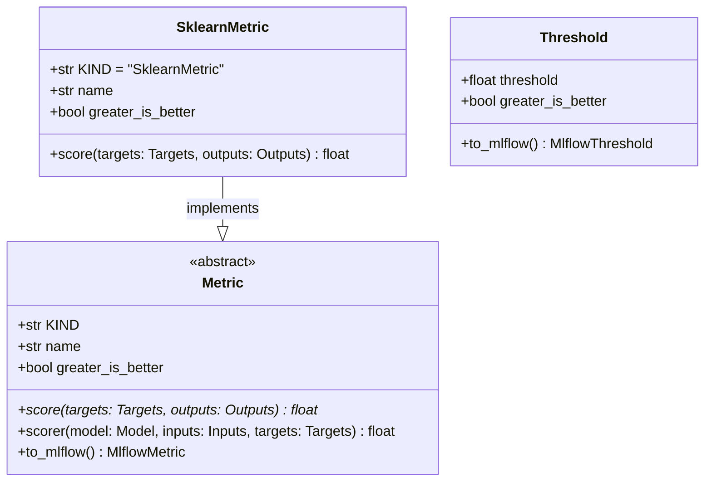

# regression_model_template::core::metrics — Metric Evaluation Abstractions

> **Source**: `src/regression_model_template/core/metrics.py` (Lines: L1-L148)  
> **Layer**: Domain  
> **Role**: Encapsulates regression evaluation scoring functions, threshold criteria, and MLflow serialization.

---

## 1. Class Diagram

---

## 2. Method Contracts

### `Metric.score(self, targets: schemas.Targets, outputs: schemas.Outputs) -> float`
- **Source Citation**: `src/regression_model_template/core/metrics.py:L44-L53`
- **Visibility**: Public (`+`)
- **Behavior**: Evaluates predictive quality between true targets and model predictions.

---

> *Related: [Models](models.md) · [Evaluations Job](../jobs/evaluations.md)*
