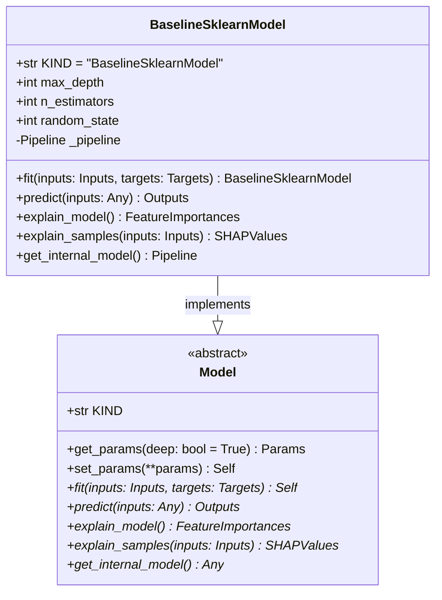

# regression_model_template::core::models — Model Abstraction & Baselines

> **Source**: `src/regression_model_template/core/models.py` (Lines: L1-L223)  
> **Layer**: Domain  
> **Role**: Unified model contract ensuring consistent fit, predict, parameter inspection, and SHAP explainability across any regression estimator.

---

## 1. Class Diagram

---

## 2. Method Contracts

### `BaselineSklearnModel.fit(self, inputs: schemas.Inputs, targets: schemas.Targets) -> 'BaselineSklearnModel'`
- **Source Citation**: `src/regression_model_template/core/models.py:L161-L183`
- **Visibility**: Public (`+`)
- **Behavior**: Assembles Scikit-Learn preprocessing transformers and Random Forest regressor, fitting estimator on validated inputs and targets.

### `BaselineSklearnModel.explain_samples(self, inputs: schemas.Inputs) -> schemas.SHAPValues`
- **Source Citation**: `src/regression_model_template/core/models.py:L204-L214`
- **Visibility**: Public (`+`)
- **Behavior**: Invokes SHAP `TreeExplainer` on the underlying fitted tree models to calculate local Shapley attribution values.

---

> *Related: [Metrics](metrics.md) · [Schemas](schemas.md) · [Training Job](../jobs/training.md)*
