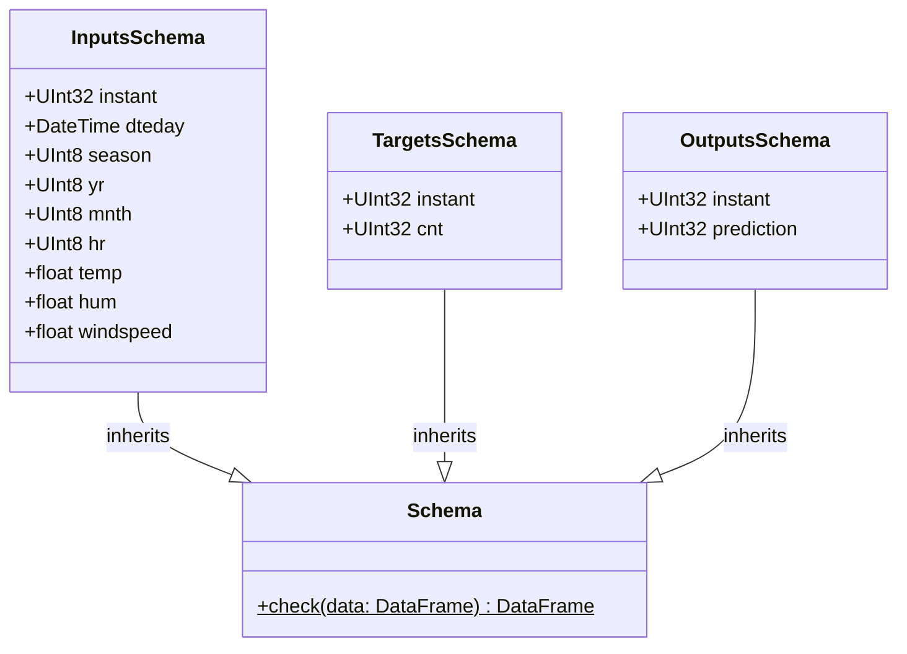

# regression_model_template::core::schemas — Pandera Data Contracts

> **Source**: `src/regression_model_template/core/schemas.py` (Lines: L1-L120)  
> **Layer**: Domain  
> **Role**: Formal tabular contracts guaranteeing type safety, index alignment, and range constraints across all pipeline boundaries.

---

## 1. Class Diagram

---

> *Related: [Data Model](../../../architecture/mission_data_model.md) · [Datasets](../io/datasets.md)*
