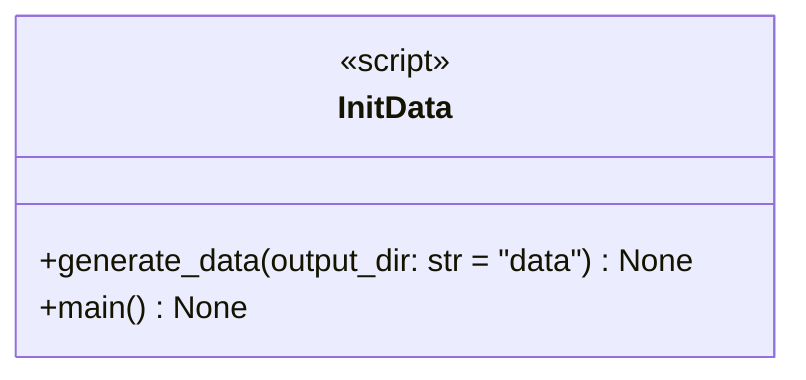

# regression_model_template::init_data — Synthetic Dataset Generator

> **Source**: `src/regression_model_template/init_data.py` (Lines: L1-L66)  
> **Layer**: Utilities / Data Seeding  
> **Role**: Generates reproducible synthetic bike sharing demand regression datasets for development and testing.

---

## 1. Component Architecture & Signatures

### `generate_data(output_dir: str = "data") -> None`
- **Source Citation**: `src/regression_model_template/init_data.py:L10-L54`
- **Visibility**: Public (`+`)
- **Behavior**: Synthesizes 1,000 hourly bike-sharing records containing calendar, weather, temperature, humidity, and windspeed features, persisting outputs as `inputs.parquet` and `targets.parquet`.

---

> *Related: [Data Model](../../architecture/mission_data_model.md) · [Datasets](io/datasets.md)*
