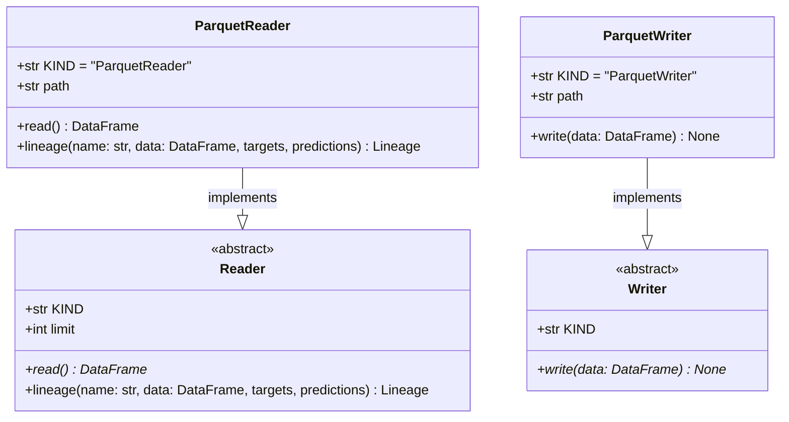

# regression_model_template::io::datasets — Tabular Dataset I/O & Lineage

> **Source**: `src/regression_model_template/io/datasets.py` (Lines: L1-L128)  
> **Layer**: Infrastructure  
> **Role**: Standardized reading and writing of tabular Parquet datasets with automated data lineage recording for MLflow tracking.

---

## 1. Class Diagram

---

> *Related: [Schemas](../core/schemas.md) · [Data Model](../../../architecture/mission_data_model.md)*
