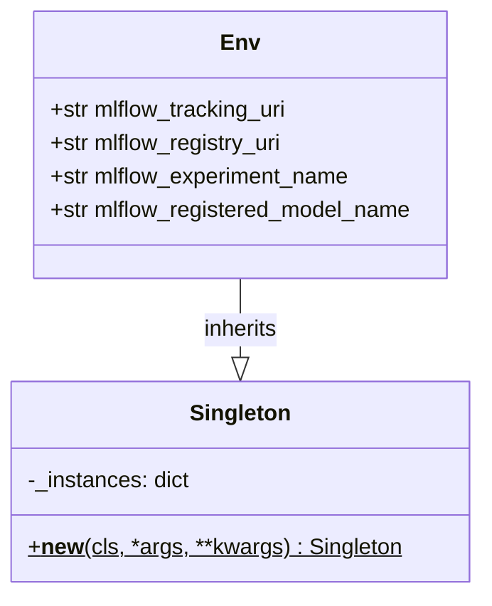

# regression_model_template::io::osvariables — Environment Settings Singleton

> **Source**: `src/regression_model_template/io/osvariables.py` (Lines: L1-L26)  
> **Layer**: Infrastructure / Configuration  
> **Role**: Thread-safe Singleton environment manager providing centralized access to MLflow endpoints and platform variables.

---

## 1. Class Diagram

---

> *Related: [Services](services.md) · [Configs](configs.md)*
