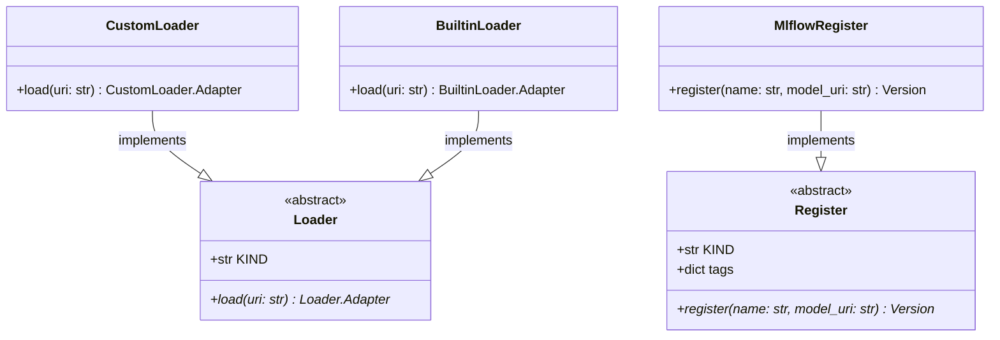

# regression_model_template::io::registries — Model Registry & Loaders

> **Source**: `src/regression_model_template/io/registries.py` (Lines: L1-L317)  
> **Layer**: Infrastructure  
> **Role**: Interfaces for registering trained model artifacts in MLflow and resolving model versions or aliases into callable prediction adapters.

---

## 1. Class Diagram

---

> *Related: [Services](services.md) · [Promotion Job](../jobs/promotion.md)*
