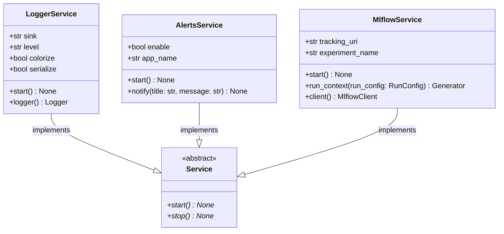

# regression_model_template::io::services — Platform Services Lifecycle

> **Source**: `src/regression_model_template/io/services.py` (Lines: L1-L252)  
> **Layer**: Infrastructure  
> **Role**: Coordinates the runtime startup, context injection, and shutdown of core platform services: structured logging, desktop/webhook alerts, and MLflow tracking.

---

## 1. Class Diagram

---

> *Related: [Base Job](../jobs/base.md) · [Registries](registries.md)*
