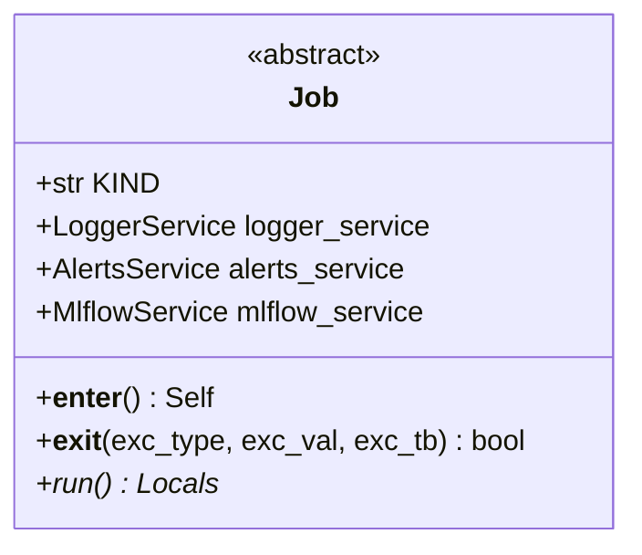

# regression_model_template::jobs::base — Job Context Manager Contract

> **Source**: `src/regression_model_template/jobs/base.py` (Lines: L1-L85)  
> **Layer**: Application  
> **Role**: Base template method coordinating service lifecycles (`LoggerService`, `AlertsService`, `MlflowService`) via the Python context manager protocol.

---

## 1. Class Diagram

---

> *Related: [Training Job](training.md) · [Tactical Design](../../../architecture/tactical_design.md)*
