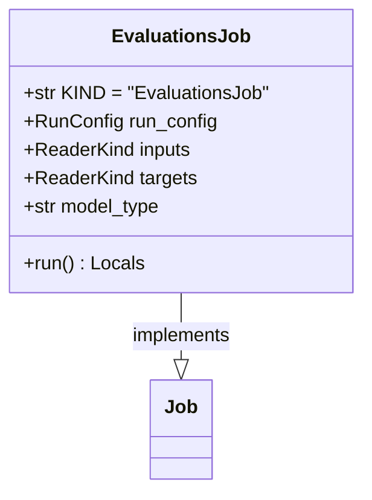

# regression_model_template::jobs::evaluations — Model Evaluation Pipeline

> **Source**: `src/regression_model_template/jobs/evaluations.py` (Lines: L1-L125)  
> **Layer**: Application  
> **Role**: Ingests test partitions, evaluates model predictions against configured metric thresholds, and logs verification reports to MLflow.

---

## 1. Class Diagram

---

> *Related: [Metrics](../core/metrics.md) · [Promotion Job](promotion.md)*
