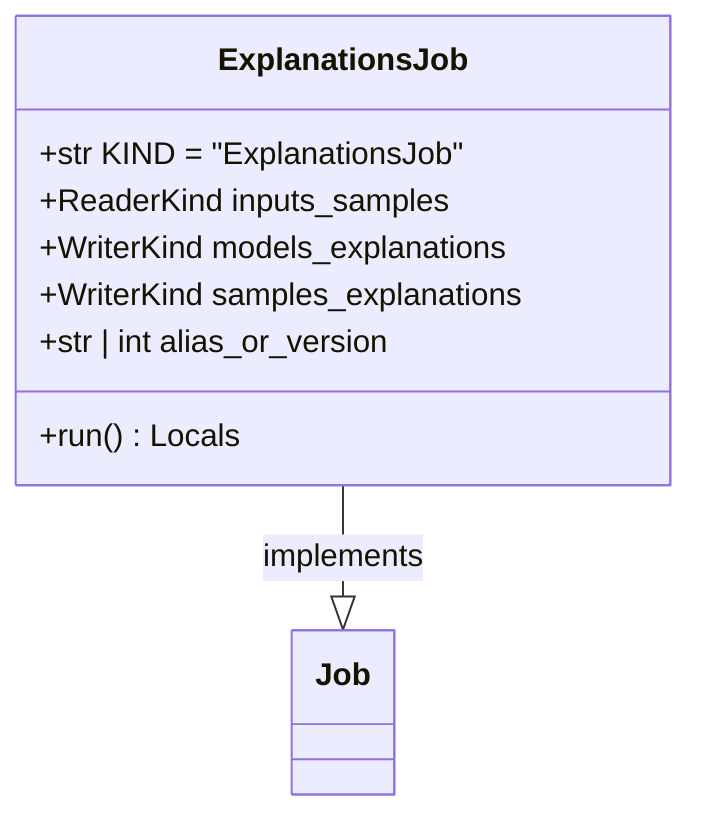

# regression_model_template::jobs::explanations — SHAP Interpretability Pipeline

> **Source**: `src/regression_model_template/jobs/explanations.py` (Lines: L1-L78)  
> **Layer**: Application  
> **Role**: Calculates global feature importances and local per-sample Shapley attribution values for trained model estimators.

---

## 1. Class Diagram

---

> *Related: [Models](../core/models.md) · [Compliance Audit](../../../security/compliance_audit.md)*
