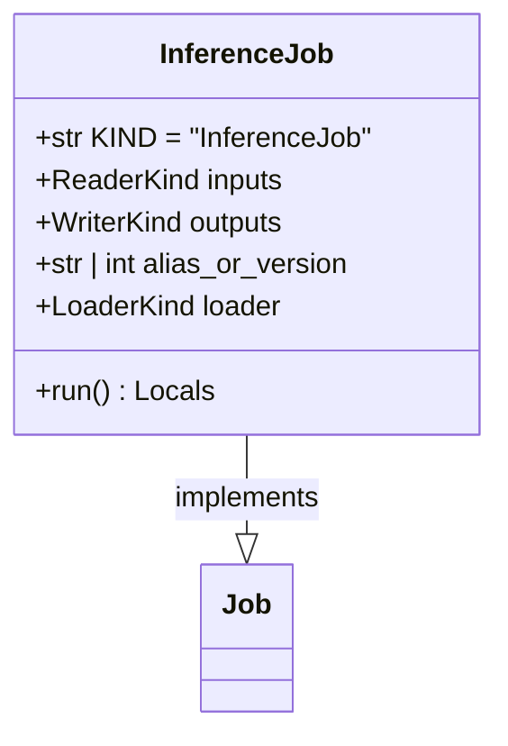

# regression_model_template::jobs::inference — Batch Prediction Pipeline

> **Source**: `src/regression_model_template/jobs/inference.py` (Lines: L1-L66)  
> **Layer**: Application  
> **Role**: Loads designated model artifacts from registry, validates inputs against Pandera schemas, produces predictions, and writes cryptographically signed output files.

---

## 1. Class Diagram

---

> *Related: [Signers](../utils/signers.md) · [Kafka App](../controller/kafka_app.md)*
