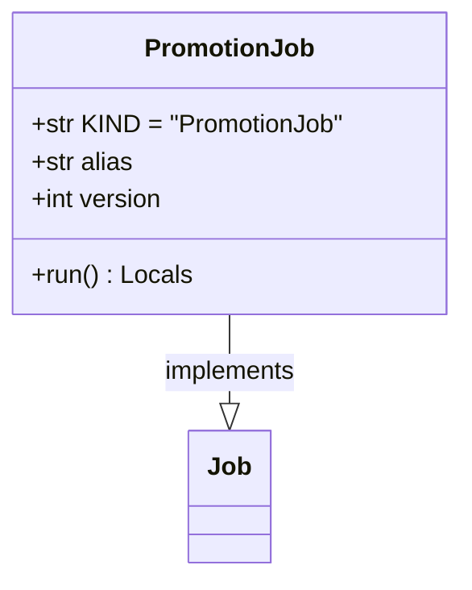

# regression_model_template::jobs::promotion — Model Registry Promotion Gate

> **Source**: `src/regression_model_template/jobs/promotion.py` (Lines: L1-L57)  
> **Layer**: Application  
> **Role**: Promotes qualified candidate model versions to target aliases (e.g. `champion`) in the MLflow Model Registry.

---

## 1. Class Diagram

---

> *Related: [HITL Governance](../../../security/hitl_governance.md) · [Registries](../io/registries.md)*
