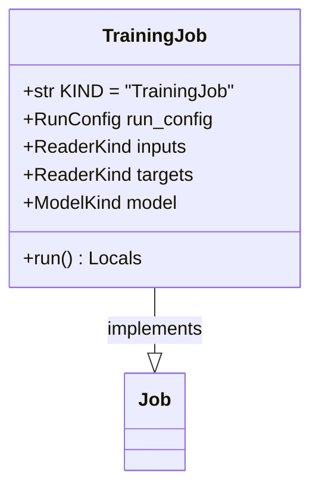

# regression_model_template::jobs::training — Model Training Pipeline

> **Source**: `src/regression_model_template/jobs/training.py` (Lines: L1-L145)  
> **Layer**: Application  
> **Role**: Ingests training data, splits partitions, fits the model estimator, evaluates train/test error, and registers artifacts with active MLflow runs.

---

## 1. Class Diagram

---

> *Related: [Models](../core/models.md) · [Tuning Job](tuning.md)*
