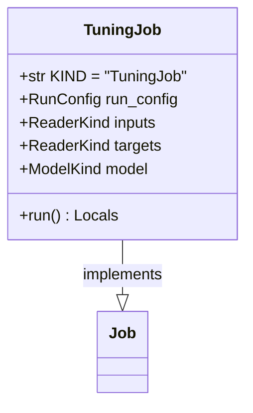

# regression_model_template::jobs::tuning — Hyperparameter Optimization Pipeline

> **Source**: `src/regression_model_template/jobs/tuning.py` (Lines: L1-L104)  
> **Layer**: Application  
> **Role**: Explores multi-dimensional hyperparameter spaces, evaluates candidate configurations across cross-validation splits, and logs trials history to MLflow.

---

## 1. Class Diagram

---

> *Related: [Searchers](../utils/searchers.md) · [Training Job](training.md)*
