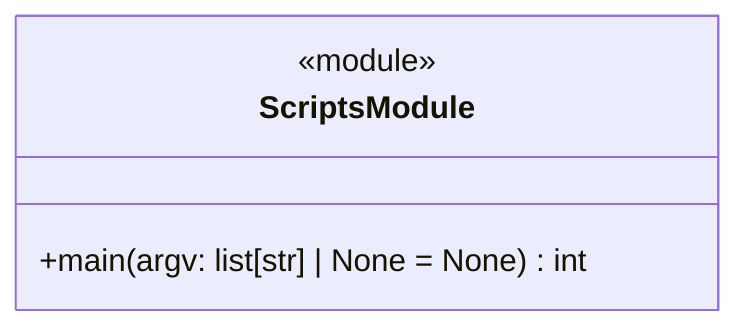

# regression_model_template::scripts — CLI Runner & Dispatcher

> **Source**: `src/regression_model_template/scripts.py` (Lines: L1-L47)  
> **Layer**: Interface / CLI  
> **Role**: Main script entrypoint loading OmegaConf settings and executing designated lifecycle jobs.

---

## 1. Component Architecture

### `main(argv: list[str] | None = None) -> int`
- **Source Citation**: `src/regression_model_template/scripts.py:L31-L47`
- **Visibility**: Public (`+`)
- **Behavior**: Parses command-line flags (e.g. `--config-name`), loads hierarchical configs via `MainSettings`, and executes `job.run()`.

---

> *Related: [Settings](settings.md) · [Base Job](jobs/base.md) · [User Manual](../../operations/user_manual.md)*
