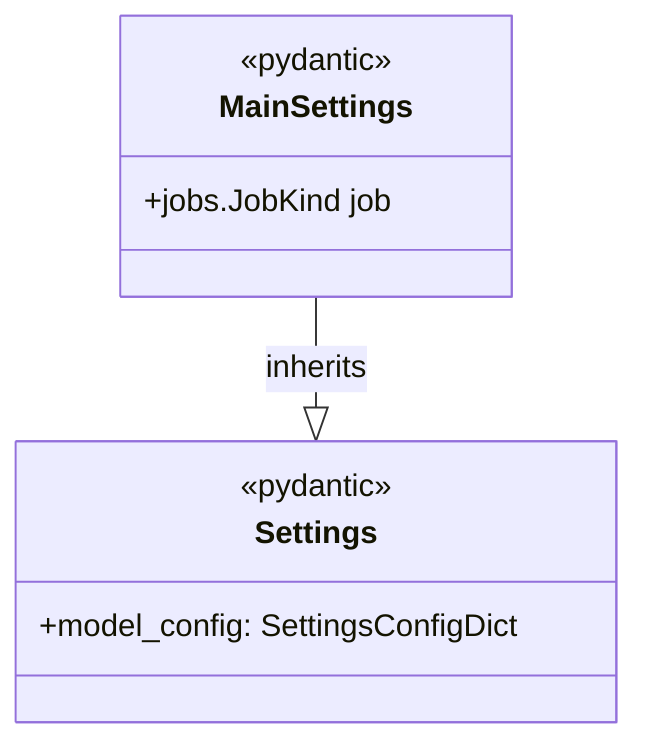

# regression_model_template::settings — Application Settings

> **Source**: `src/regression_model_template/settings.py` (Lines: L1-L28)  
> **Layer**: Configuration  
> **Role**: Declares application-wide Pydantic settings models for job execution.

---

## 1. Class Diagram

---

> *Related: [Scripts](scripts.md) · [Configs](io/configs.md)*
