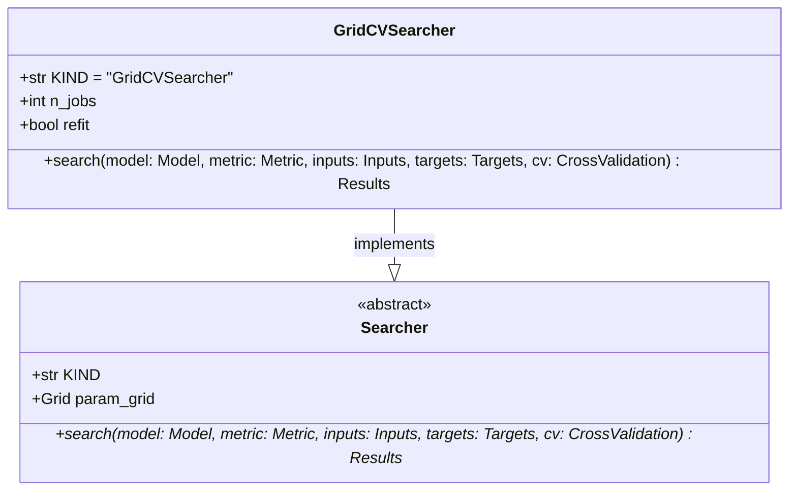

# regression_model_template::utils::searchers — Hyperparameter Searchers

> **Source**: `src/regression_model_template/utils/searchers.py` (Lines: L1-L116)  
> **Layer**: Utilities  
> **Role**: Strategy abstraction executing parameter space traversals (Grid Search, Optuna Bayesian optimization) against regression models.

---

## 1. Class Diagram

---

> *Related: [Tuning Job](../jobs/tuning.md) · [Splitters](splitters.md)*
