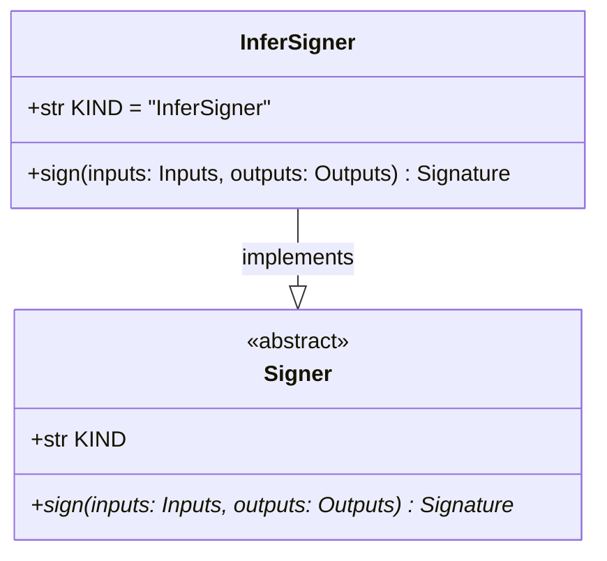

# regression_model_template::utils::signers — Cryptographic Attestation

> **Source**: `src/regression_model_template/utils/signers.py` (Lines: L1-L54)  
> **Layer**: Utilities / Security  
> **Role**: Produces tamper-evident SHA-256 digital signatures over serialized prediction inputs and outputs for compliance auditability.

---

## 1. Class Diagram

---

> *Related: [Security Architecture](../../../security/security_architecture.md) · [Inference Job](../jobs/inference.md)*
