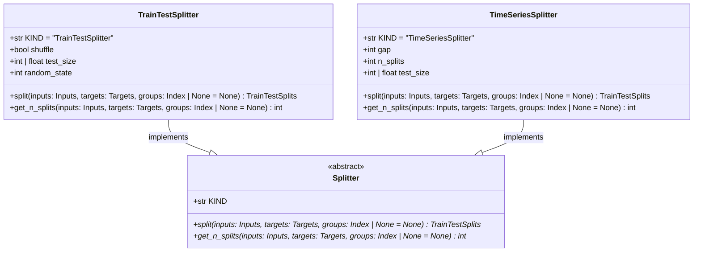

# regression_model_template::utils::splitters — Dataset Partitioning Strategies

> **Source**: `src/regression_model_template/utils/splitters.py` (Lines: L1-L111)  
> **Layer**: Utilities  
> **Role**: Strategy abstraction partitioning tabular datasets into train and test splits, supporting random shuffling and strict temporal ordering.

---

## 1. Class Diagram

---

> *Related: [Training Job](../jobs/training.md) · [Searchers](searchers.md)*
