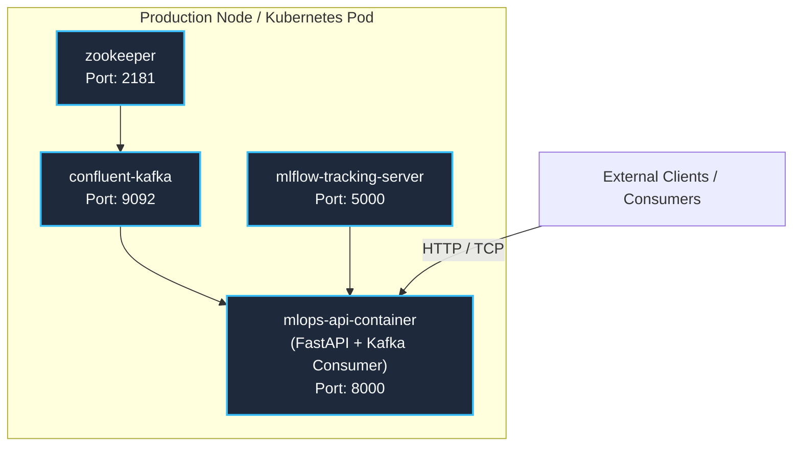

# Production Operations & Deployment Runbook

> **Purpose**: Production runbook covering container architecture, Docker Compose orchestration, health monitoring, and incident mitigation procedures.

---

## 1. Production Topology & Multi-Service Compose



### Launching Multi-Service Stack
```bash
# Launch Kafka, Zookeeper, and MLflow
docker-compose up -d

# Verify container health
docker-compose ps
```

---

## 2. Standard Operating Procedures (Runbook)

### Procedure 1: Restarting Streaming Consumer
If Kafka partition rebalancing hangs or consumer lag accumulates:
```bash
docker-compose restart app
```

### Procedure 2: Inspecting Consumer Lag
```bash
docker exec -it kafka kafka-consumer-groups \
  --bootstrap-server localhost:9092 \
  --describe --group mlops-prediction-group
```

### Procedure 3: Diagnostic Health Verification
```bash
# Check service status
curl -i http://localhost:8000/health

# Inspect real-time container logs
docker logs --tail 100 -f mlops-api
```

---

## 3. Incident Mitigation Matrix

| Symptom | Root Cause | Remediation Procedure |
|:---|:---|:---|
| **HTTP 429 Too Many Requests** | Client exceeding 100 req/60s quota | Inspect client source IP; adjust rate limit window in `confs/app.yaml`. |
| **Kafka Commit Failed Error** | Message processing exceeded timeout | Increase `max.poll.interval.ms` or scale batch prediction workers. |
| **Schema Validation Error** | Input payload missing columns | Review incoming JSON against `InputsSchema`; inspect DLQ topic. |
| **MLflow Connection Refused** | Tracking server down or unreachable | Verify MLflow container status; test network route to `MLFLOW_TRACKING_URI`. |

---

> *Related: [User Manual](user_manual.md) · [Security Architecture](../security/security_architecture.md) · [Master Index](../index.md)*
