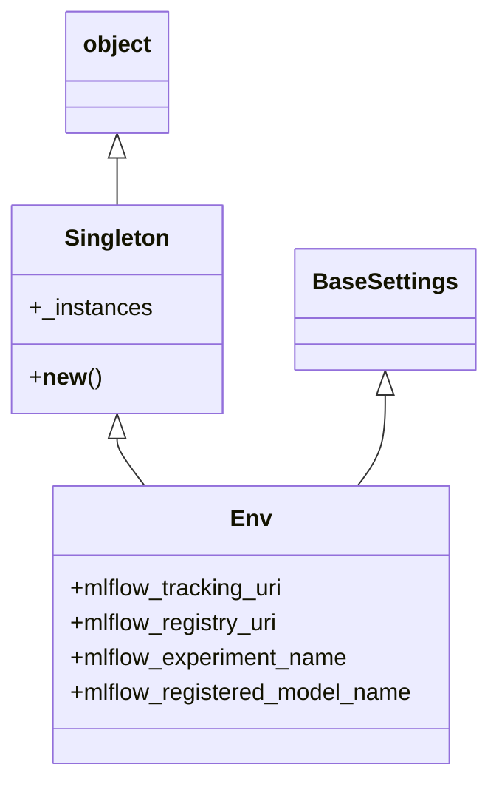
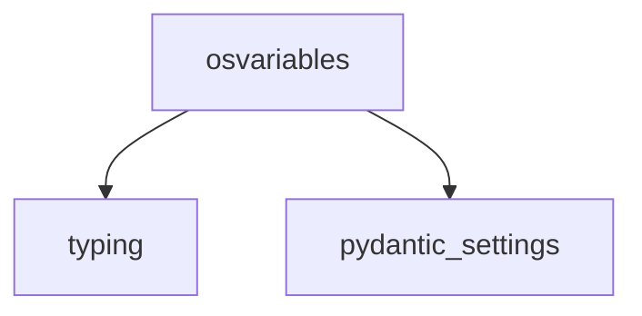

# osvariables

Source File: `src/regression_model_template/io/osvariables.py`

Documentation for regression_model_template.io.osvariables

```mermaid
classDiagram
    object <|-- Singleton
    class Singleton {
        +_instances
        +__new__()
    }
    Singleton <|-- Env
    BaseSettings <|-- Env
    class Env {
        +mlflow_tracking_uri
        +mlflow_registry_uri
        +mlflow_experiment_name
        +mlflow_registered_model_name
    }
```

```mermaid
flowchart TD
    osvariables --> typing
    osvariables --> pydantic_settings
```
