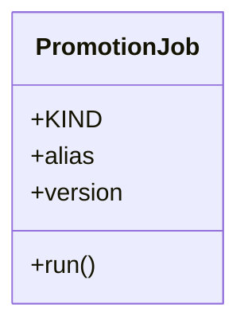
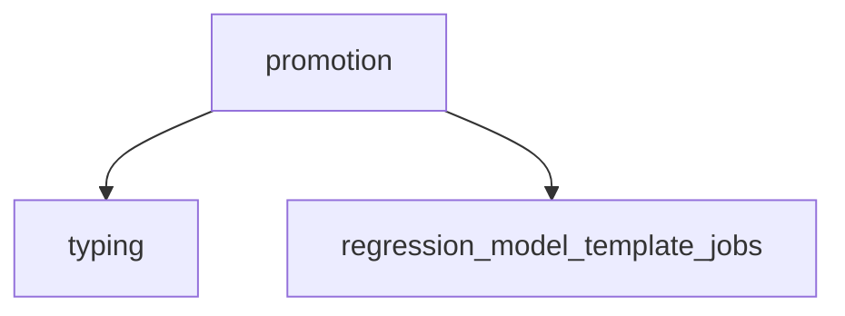

# promotion

Source File: `src/regression_model_template/jobs/promotion.py`

Define a job for promoting a registered model version with an alias.

```mermaid
classDiagram
    class PromotionJob {
        +KIND
        +alias
        +version
        +run()
    }
```

```mermaid
flowchart TD
    promotion --> typing
    promotion --> regression_model_template_jobs
```
