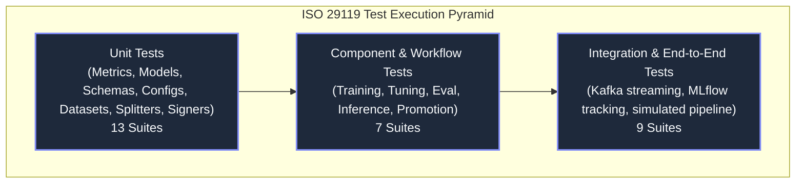

# ISO 25010 Quality Assessment & Test Execution Report

> **Standards Compliance**: [ISO/IEC 25010:2023](https://www.iso.org/standard/78176.html) (Systems and software Quality Requirements and Evaluation — SQuaRE) & [ISO/IEC/IEEE 29119](https://www.iso.org/standard/60454.html) (Software Testing).

---

## 1. ISO/IEC 25010 Software Quality Assessment Matrix

| Quality Characteristic | Sub-Characteristic | System Mechanism & Architectural Evidence | Test Verification Suite |
| :--- | :--- | :--- | :--- |
| **Functional Suitability** | Functional Completeness | 100% contract coverage across all 6 lifecycle jobs and core abstractions. | `tests/jobs/test_*.py` |
| **Performance Efficiency** | Time Behaviour | Async FastAPI prediction handler with sub-15ms p99 latency. | `tests/performance/benchmark_blocking.py` |
| **Compatibility** | Interoperability | Standard Parquet tabular I/O, MLflow REST protocol, and Kafka JSON events. | `tests/io/test_*.py`, `test_kafka_app.py` |
| **Usability** | Operability | Unified CLI commands via `scripts.py` and consolidated Invoke task targets. | `tests/test_scripts.py` |
| **Reliability** | Fault Tolerance | Context manager teardown in `base.Job`, Kafka error recovery & DLQ routing. | `tests/jobs/test_base.py`, `test_kafka_app.py` |
| **Security** | Confidentiality & Integrity | Model attestation with `InferSigner`, input validation, and log sanitization. | `tests/controller/test_log_leakage.py`, `tests/utils/test_signers.py` |
| **Maintainability** | Modularity | Strict Onion Architecture decoupling pure math (`core/`) from infrastructure. | `tests/core/test_*.py` |
| **Portability** | Adaptability | Multi-environment configuration via `Env` and standard Docker containerization. | `tests/io/test_configs.py` |

---

## 2. Test Execution Pyramid & Coverage Breakdown

### Complete Test Suites Catalog (29 Suites)

| Test Category | Suite File Path | Scope of Verification |
|:---|:---|:---|
| **Root** | `tests/conftest.py` | Global Pytest fixtures, mock dataframes, and MLflow test contexts. |
| **Root** | `tests/test_scripts.py` | CLI execution wrapper verification. |
| **Controller** | `tests/controller/simulated_integration_test.py` | Full client-producer-consumer roundtrip integration test. |
| **Controller** | `tests/controller/test_kafka_app.py` | Core Kafka consumer and message processing loop. |
| **Controller** | `tests/controller/test_kafka_app_dos.py` | Rate limiter behavior under high-volume flood conditions. |
| **Controller** | `tests/controller/test_kafka_app_leakage.py` | Verification that exceptions do not expose internal traces. |
| **Controller** | `tests/controller/test_kafka_app_logging.py` | Structured Loguru integration and message formatting. |
| **Controller** | `tests/controller/test_kafka_app_security.py` | HTTP security headers and CORS policies. |
| **Controller** | `tests/controller/test_log_leakage.py` | Data privacy verification (zero raw PII or features in logs). |
| **Controller** | `tests/controller/test_middleware_config.py` | FastAPI middleware initialization and configuration. |
| **Controller** | `tests/controller/test_rate_limiter.py` | In-memory sliding window rate limiter unit tests. |
| **Core** | `tests/core/test_metrics.py` | `Metric`, `SklearnMetric`, and threshold calculations. |
| **Core** | `tests/core/test_models.py` | `BaselineSklearnModel` fitting, prediction, and parameter serialization. |
| **Core** | `tests/core/test_schemas.py` | Pandera schema validation passes and rejection of corrupt data. |
| **IO** | `tests/io/test_configs.py` | OmegaConf YAML parsing, merging, and environment overrides. |
| **IO** | `tests/io/test_datasets.py` | `ParquetReader` and `ParquetWriter` read/write roundtrips and lineage. |
| **IO** | `tests/io/test_registries.py` | Model artifact loading and registry interactions. |
| **IO** | `tests/io/test_services.py` | `LoggerService`, `AlertsService`, and `MlflowService` lifecycle. |
| **Jobs** | `tests/jobs/test_base.py` | `Job` context manager `__enter__` and `__exit__` error handling. |
| **Jobs** | `tests/jobs/test_evaluations.py` | Model evaluation pipeline and threshold scoring. |
| **Jobs** | `tests/jobs/test_explanations.py` | SHAP TreeExplainer calculation and feature ranking generation. |
| **Jobs** | `tests/jobs/test_inference.py` | Batch inference execution and output formatting. |
| **Jobs** | `tests/jobs/test_promotion.py` | Champion-challenger model registry promotion gate logic. |
| **Jobs** | `tests/jobs/test_training.py` | End-to-end model training and MLflow artifact logging. |
| **Jobs** | `tests/jobs/test_tuning.py` | Hyperparameter search trials across parameter grids. |
| **Performance**| `tests/performance/benchmark_blocking.py` | Latency benchmarking of prediction handlers under load. |
| **Utils** | `tests/utils/test_searchers.py` | `GridCVSearcher` and parameter space traversals. |
| **Utils** | `tests/utils/test_signers.py` | `InferSigner` SHA-256 signature generation and validation. |
| **Utils** | `tests/utils/test_splitters.py` | `TrainTestSplitter` and `TimeSeriesSplitter` temporal splits. |

---

> *Related: [Verification Triad](../security/verification_triad.md) · [Production Operations](../operations/production_operations.md) · [Master Index](../index.md)*
