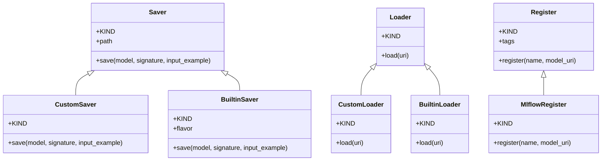
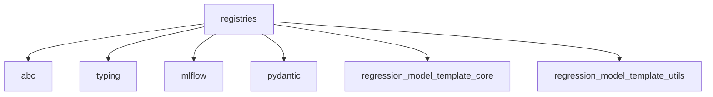

# registries

Source File: `src/regression_model_template/io/registries.py`

Savers, loaders, and registers for model registries.

```mermaid
classDiagram
    class Saver {
        +KIND
        +path
        +save(model, signature, input_example)
    }
    Saver <|-- CustomSaver
    class CustomSaver {
        +KIND
        +save(model, signature, input_example)
    }
    Saver <|-- BuiltinSaver
    class BuiltinSaver {
        +KIND
        +flavor
        +save(model, signature, input_example)
    }
    class Loader {
        +KIND
        +load(uri)
    }
    Loader <|-- CustomLoader
    class CustomLoader {
        +KIND
        +load(uri)
    }
    Loader <|-- BuiltinLoader
    class BuiltinLoader {
        +KIND
        +load(uri)
    }
    class Register {
        +KIND
        +tags
        +register(name, model_uri)
    }
    Register <|-- MlflowRegister
    class MlflowRegister {
        +KIND
        +register(name, model_uri)
    }
```

```mermaid
flowchart TD
    registries --> abc
    registries --> typing
    registries --> mlflow
    registries --> pydantic
    registries --> regression_model_template_core
    registries --> regression_model_template_utils
```
