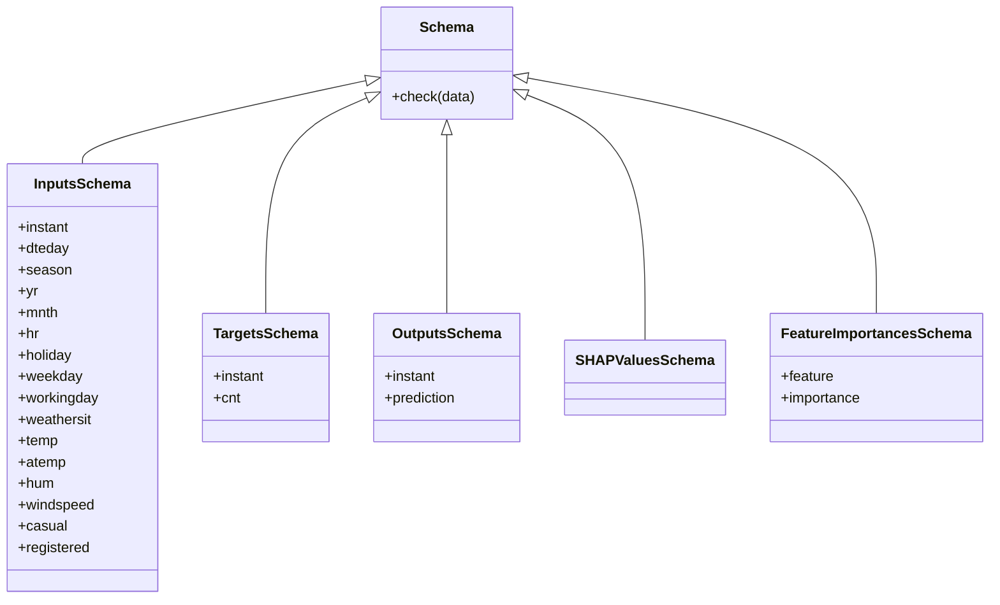
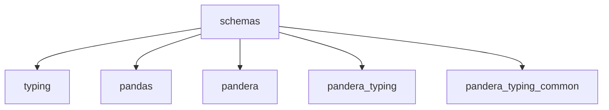

# schemas

Source File: `src/regression_model_template/core/schemas.py`

Define and validate dataframe schemas.

```mermaid
classDiagram
    class Schema {
        +check(data)
    }
    Schema <|-- InputsSchema
    class InputsSchema {
        +instant
        +dteday
        +season
        +yr
        +mnth
        +hr
        +holiday
        +weekday
        +workingday
        +weathersit
        +temp
        +atemp
        +hum
        +windspeed
        +casual
        +registered
    }
    Schema <|-- TargetsSchema
    class TargetsSchema {
        +instant
        +cnt
    }
    Schema <|-- OutputsSchema
    class OutputsSchema {
        +instant
        +prediction
    }
    Schema <|-- SHAPValuesSchema
    class SHAPValuesSchema {
    }
    Schema <|-- FeatureImportancesSchema
    class FeatureImportancesSchema {
        +feature
        +importance
    }
```

```mermaid
flowchart TD
    schemas --> typing
    schemas --> pandas
    schemas --> pandera
    schemas --> pandera_typing
    schemas --> pandera_typing_common
```
