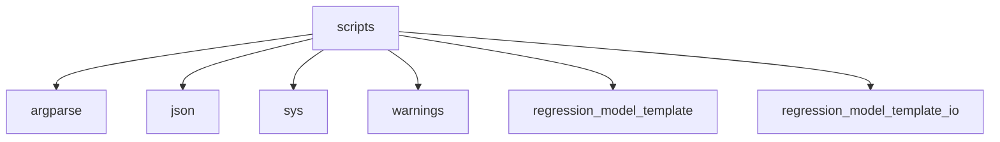

# scripts

Source File: `src/regression_model_template/scripts.py`

Scripts for the CLI application.

```mermaid
flowchart TD
    scripts --> argparse
    scripts --> json
    scripts --> sys
    scripts --> warnings
    scripts --> regression_model_template
    scripts --> regression_model_template_io
```
