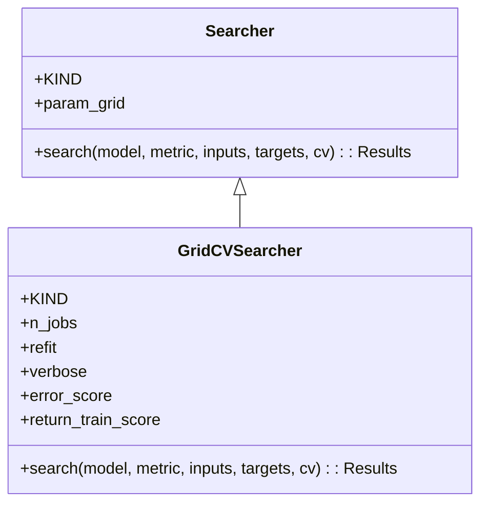
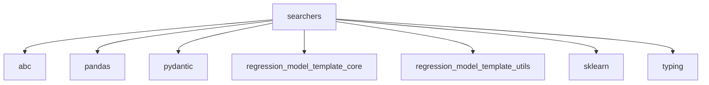

# searchers

Source File: `src/regression_model_template/utils/searchers.py`

Find the best hyperparameters for a model.

```mermaid
classDiagram
    class Searcher {
        +KIND
        +param_grid
        +search(model, metric, inputs, targets, cv) : Results
    }
    class GridCVSearcher {
        +KIND
        +n_jobs
        +refit
        +verbose
        +error_score
        +return_train_score
        +search(model, metric, inputs, targets, cv) : Results
    }
    Searcher <|-- GridCVSearcher
```

```mermaid
flowchart TD

    searchers --> abc
    searchers --> pandas
    searchers --> pydantic
    searchers --> regression_model_template_core
    searchers --> regression_model_template_utils
    searchers --> sklearn
    searchers --> typing
```
