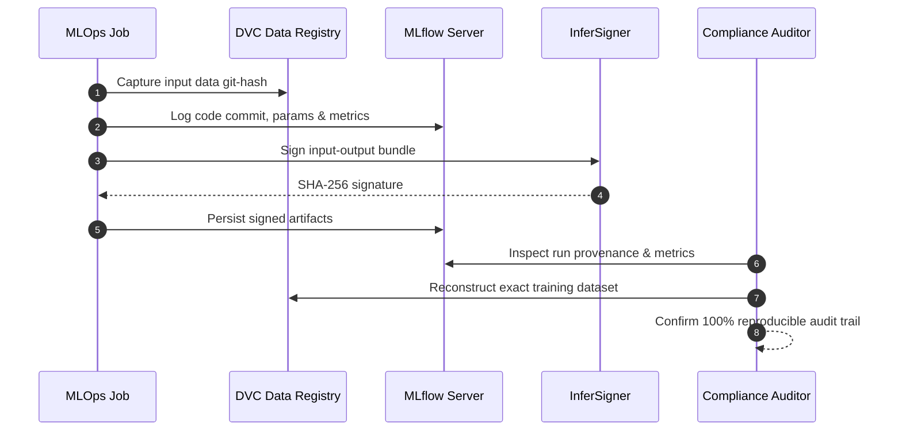

# Compliance & Audit Trail Specification

> **Purpose**: Document regulatory compliance alignments, specifically addressing EU AI Act (Regulation 2024/1689) requirements for high-risk AI lifecycle management.

---

## 1. EU AI Act Conformity Assessment

| EU AI Act Article | Regulatory Requirement | Repository Implementation Mechanism |
|:---|:---|:---|
| **Article 10** | **Data Governance**: Datasets must be relevant, representative, and validated. | DVC immutable versioning, Parquet schema enforcement, Pandera validation. |
| **Article 11** | **Technical Documentation**: Comprehensive technical records before market placement. | ISO 42010 / 15289 wiki documentation with 1:1 codebase mirroring. |
| **Article 12** | **Record-Keeping & Logging**: Automatic logging of events over the system lifecycle. | MLflow run parameter tracking, Loguru structured logs, SHA-256 signatures. |
| **Article 13** | **Transparency**: Output must be interpretable to deployers and users. | SHAP TreeExplainer feature attributions generated by `ExplanationsJob`. |
| **Article 14** | **Human Oversight**: High-risk AI systems must allow effective human intervention. | Human-in-the-Loop (HITL) merge policy and model promotion gates. |
| **Article 15** | **Accuracy & Robustness**: Resilient against errors, faults, and adversarial inputs. | 29 Pytest suites, Pandera schema guards, rate-limited FastAPI endpoints. |

---

## 2. Audit Trail Data Flow

---

> *Related: [HITL Governance](hitl_governance.md) · [Security Architecture](security_architecture.md) · [Master Index](../index.md)*
