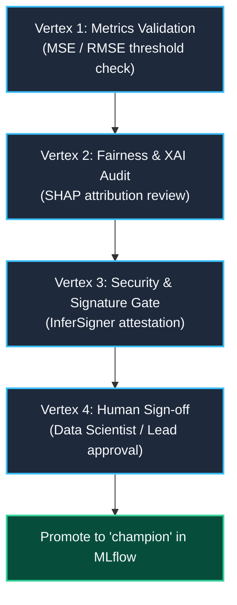

# Human-in-the-Loop (HITL) Governance Policy

> **Policy Directive**: Automated agents and CI/CD pipelines are strictly prohibited from automatically merging code into `main` or promoting machine learning models to production aliases without explicit human sign-off.

---

## 1. Governance Principles

1. **Non-Autonomous Production Promotion**: Model promotion to the `champion` alias requires human review of evaluation metrics and XAI reports.
2. **Mandatory Human PR Review**: Autonomous factory agents (Dark Gravity / ZeroClaw / Jules) may create feature branches and open PRs, but **merges into default branches MUST be a manual human action**.
3. **Four-Vertex Promotion Mesh**: Prior to promoting any candidate model, four quality gates must be satisfied:

---

## 2. Threshold Check Criteria

| Metric | Promotion Condition | Rationale |
|:---|:---|:---|
| **$R^2$ Score** | $R^2_{	ext{challenger} \ge R^2_{	ext{champion}$ | Model explanatory power must not regress. |
| **RMSE** | $	ext{RMSE}_{	ext{challenger} \le 	ext{RMSE}_{	ext{champion} 	imes 1.02$ | Absolute error must remain within 2% margin. |
| **SHAP Drift** | Top-3 features match baseline ranking | Prevents anomalous feature weight distortions. |
| **Schema Compatibility** | 100% Pandera validation | Guarantees zero input contract breakage. |

---

> *Related: [Verification Triad](verification_triad.md) · [Compliance Audit](compliance_audit.md) · [Master Index](../index.md)*
