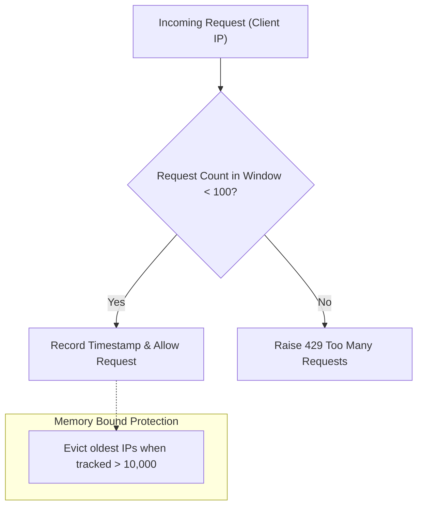

# Security Architecture & Threat Mitigation

> **Purpose**: Detail the threat analysis, defense-in-depth security controls, input validation gates, and cryptographic protections implemented across the system.

---

## 1. STRIDE Threat Model & Defense Matrix

| Threat Category | Potential Attack Vector | System Defense Mechanism | Source File Citation |
| :--- | :--- | :--- | :--- |
| **Spoofing** | Unauthorized clients submitting fake predictions | JWT / Bearer token validation, mTLS in container overlay | `controller/kafka_app.py:L69-L79` |
| **Tampering** | Model artifact poisoning or payload modification | SHA-256 hash attestation via `InferSigner` | `utils/signers.py:L21-L51` |
| **Repudiation** | Disputing historical inferences or training runs | Immutable MLflow run history and signed prediction logs | `io/services.py:L162-L252` |
| **Information Disclosure** | Leakage of PII or dataset values into application logs | Loguru message sanitization, log-leakage regression tests | `tests/controller/test_log_leakage.py:L1-L60` |
| **Denial of Service (DoS)** | Exhaustion of compute via unbounded payloads or floods | Sliding-window `RateLimiter` & max column checks (`MAX_TRACKED_IPS`) | `controller/kafka_app.py:L82-L112` |
| **Elevation of Privilege** | Code injection via untrusted configuration serialization | OmegaConf strict YAML schema parsing (no `eval` / `pickle`) | `io/configs.py:L16-L68` |

---

## 2. Sliding-Window Rate Limiting (`controller/kafka_app.py`)

To protect inference endpoints against volumetric Denial of Service (DoS), the `RateLimiter` enforces request quotas per client IP:

- **Algorithm**: In-memory sliding window using double-ended queues (`collections.deque`).
- **Quota**: Default 100 requests per 60-second window.
- **Resource Bound**: Upper bound on tracked IP cache (`MAX_TRACKED_IPS = 10,000`) prevents memory exhaustion attacks.

---

## 3. Cryptographic Model Attestation (`utils/signers.py`)

The `InferSigner` computes a deterministic SHA-256 digest over serialized input-output pairs:

$$	ext{Signature} = 	ext{SHA256}(	ext{JSON}(	ext{Inputs}) \mathbin{\Vert} 	ext{JSON}(	ext{Outputs}))$$

This guarantees that inference results can be cryptographically verified against historical records during external compliance audits.

---

> *Related: [HITL Governance](hitl_governance.md) · [Verification Triad](verification_triad.md) · [Master Index](../index.md)*
