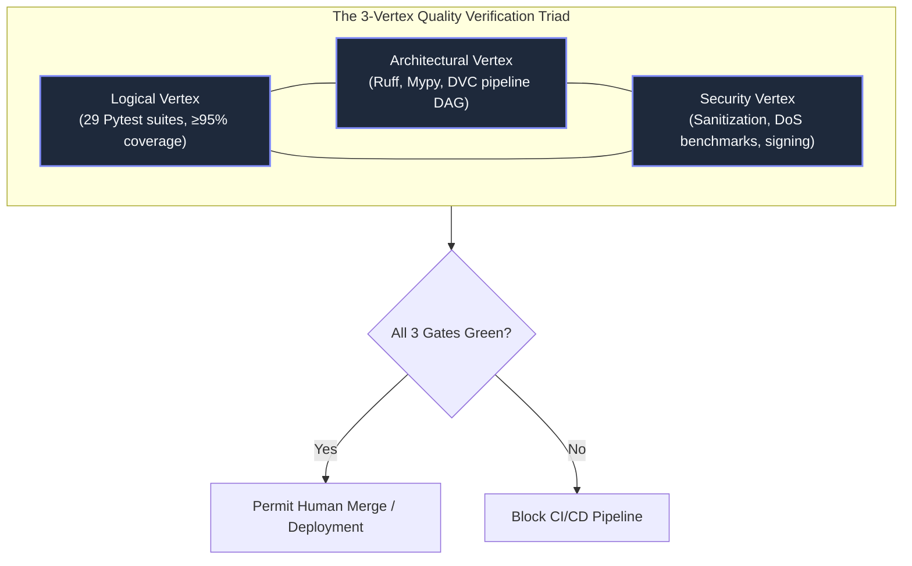

# Verification Triad — Three-Vertex Quality Gates

> **Purpose**: Define the 3-vertex quality verification triad governing all code modifications and pull requests before deployment.

---

## 1. The Verification Triad Model

---

## 2. Vertex Specifications

### Vertex 1: Logical Quality Gate
- **Tooling**: `pytest`, `pytest-cov`, `pytest-mock`.
- **Criteria**:
  - All 29 unit and integration test suites in `tests/` pass with zero failures.
  - Overall codebase test coverage reaches or exceeds 95%.
  - Execution spans controller, core, io, jobs, performance, and utility submodules.

### Vertex 2: Architectural Quality Gate
- **Tooling**: `ruff` (linter and formatter), `mypy` (strict static typing), `dvc` (DAG validation).
- **Criteria**:
  - Zero linting errors under standard rules (`ruff check .`).
  - Zero type inconsistency errors under strict type checking (`mypy src/`).
  - Data pipelines defined in `dvc.yaml` execute deterministically via `dvc repro`.

### Vertex 3: Security & Sanitization Quality Gate
- **Tooling**: Security test suites, Bandit AST scanner, memory benchmarks.
- **Criteria**:
  - Zero sensitive data or raw payload leakage into application logs (`tests/controller/test_log_leakage.py`).
  - Rate limiting sliding window prevents DoS floods (`tests/controller/test_rate_limiter.py`, `test_kafka_app_dos.py`).
  - Cryptographic signatures generated and verified on inference outputs.

---

> *Related: [Security Architecture](security_architecture.md) · [HITL Governance](hitl_governance.md) · [Test Plan](../quality/test_plan_report.md)*
