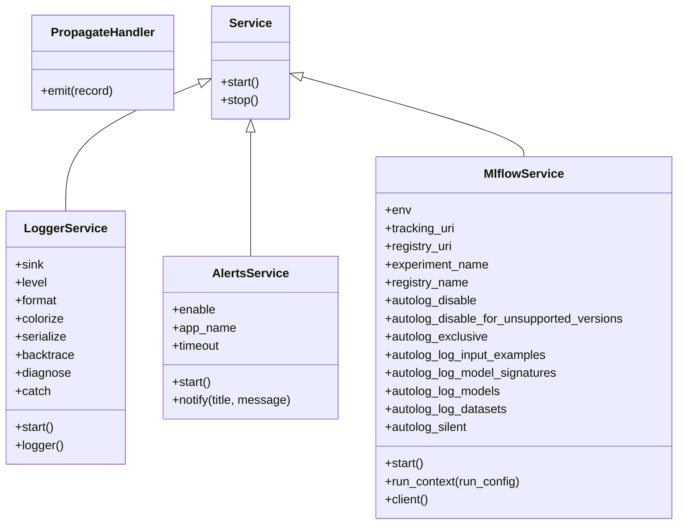

# services

Source File: `src/regression_model_template/io/services.py`

Manage global context during execution.

```mermaid
classDiagram
    class PropagateHandler {
        +emit(record)
    }
    class Service {
        +start()
        +stop()
    }
    Service <|-- LoggerService
    class LoggerService {
        +sink
        +level
        +format
        +colorize
        +serialize
        +backtrace
        +diagnose
        +catch
        +start()
        +logger()
    }
    Service <|-- AlertsService
    class AlertsService {
        +enable
        +app_name
        +timeout
        +start()
        +notify(title, message)
    }
    Service <|-- MlflowService
    class MlflowService {
        +env
        +tracking_uri
        +registry_uri
        +experiment_name
        +registry_name
        +autolog_disable
        +autolog_disable_for_unsupported_versions
        +autolog_exclusive
        +autolog_log_input_examples
        +autolog_log_model_signatures
        +autolog_log_models
        +autolog_log_datasets
        +autolog_silent
        +start()
        +run_context(run_config)
        +client()
    }
```

```mermaid
flowchart TD
    services --> __future__
    services --> abc
    services --> contextlib
    services --> logging
    services --> sys
    services --> typing
    services --> typing
    services --> loguru
    services --> mlflow
    services --> mlflow_tracking
    services --> pydantic
    services --> opentelemetry
    services --> opentelemetry__logs
    services --> opentelemetry_exporter_otlp_proto_http__log_exporter
    services --> opentelemetry_exporter_otlp_proto_http_trace_exporter
    services --> opentelemetry_sdk__logs
    services --> opentelemetry_sdk__logs_export
    services --> opentelemetry_sdk_resources
    services --> opentelemetry_sdk_trace
    services --> opentelemetry_sdk_trace_export
    services --> plyer
    services --> regression_model_template_io_osvariables
```
