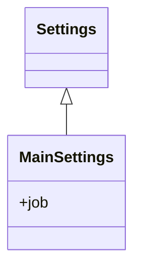
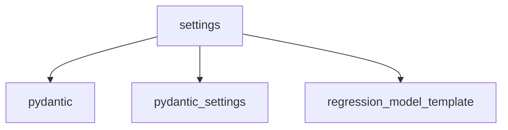

# settings

Source File: `src/regression_model_template/settings.py`

Define settings for the application.

```mermaid
classDiagram
    class Settings {
    }
    class MainSettings {
        +job
    }
    Settings <|-- MainSettings
```

```mermaid
flowchart TD

    settings --> pydantic
    settings --> pydantic_settings
    settings --> regression_model_template
```
