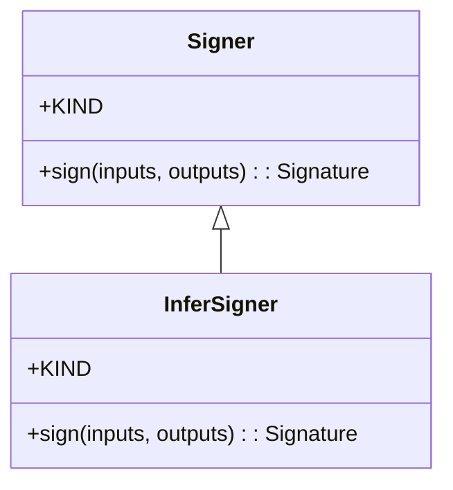
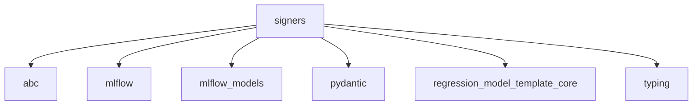

# signers

Source File: `src/regression_model_template/utils/signers.py`

Generate signatures for AI/ML models.

```mermaid
classDiagram
    class Signer {
        +KIND
        +sign(inputs, outputs) : Signature
    }
    class InferSigner {
        +KIND
        +sign(inputs, outputs) : Signature
    }
    Signer <|-- InferSigner
```

```mermaid
flowchart TD

    signers --> abc
    signers --> mlflow
    signers --> mlflow_models
    signers --> pydantic
    signers --> regression_model_template_core
    signers --> typing
```
