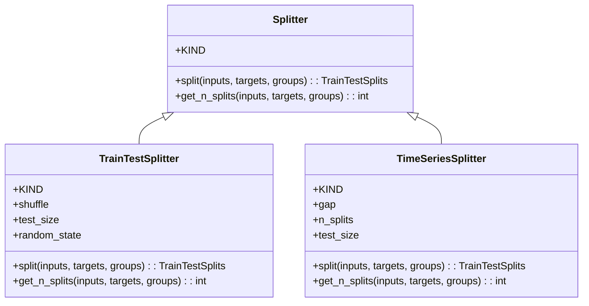
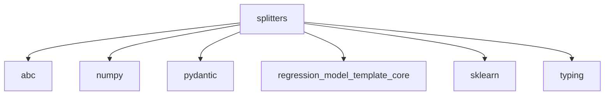

# splitters

Source File: `src/regression_model_template/utils/splitters.py`

Split dataframes into subsets (e.g., train/valid/test).

```mermaid
classDiagram
    class Splitter {
        +KIND
        +split(inputs, targets, groups) : TrainTestSplits
        +get_n_splits(inputs, targets, groups) : int
    }
    class TrainTestSplitter {
        +KIND
        +shuffle
        +test_size
        +random_state
        +split(inputs, targets, groups) : TrainTestSplits
        +get_n_splits(inputs, targets, groups) : int
    }
    Splitter <|-- TrainTestSplitter
    class TimeSeriesSplitter {
        +KIND
        +gap
        +n_splits
        +test_size
        +split(inputs, targets, groups) : TrainTestSplits
        +get_n_splits(inputs, targets, groups) : int
    }
    Splitter <|-- TimeSeriesSplitter
```

```mermaid
flowchart TD

    splitters --> abc
    splitters --> numpy
    splitters --> pydantic
    splitters --> regression_model_template_core
    splitters --> sklearn
    splitters --> typing
```
