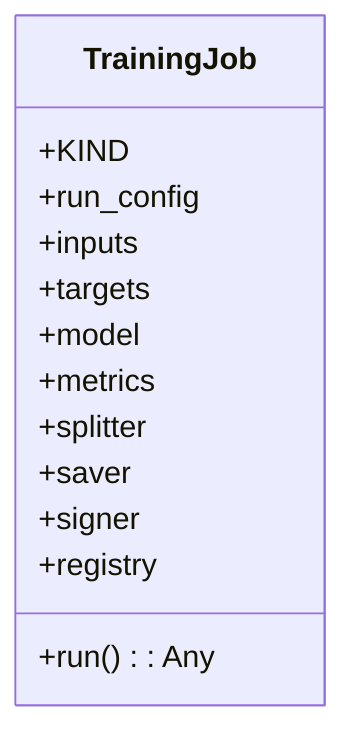
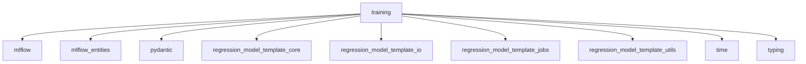

# training

Source File: `src/regression_model_template/jobs/training.py`

Define a job for training and registring a single AI/ML model.

```mermaid
classDiagram
    class TrainingJob {
        +KIND
        +run_config
        +inputs
        +targets
        +model
        +metrics
        +splitter
        +saver
        +signer
        +registry
        +run() : Any
    }
```

```mermaid
flowchart TD

    training --> mlflow
    training --> mlflow_entities
    training --> pydantic
    training --> regression_model_template_core
    training --> regression_model_template_io
    training --> regression_model_template_jobs
    training --> regression_model_template_utils
    training --> time
    training --> typing
```
