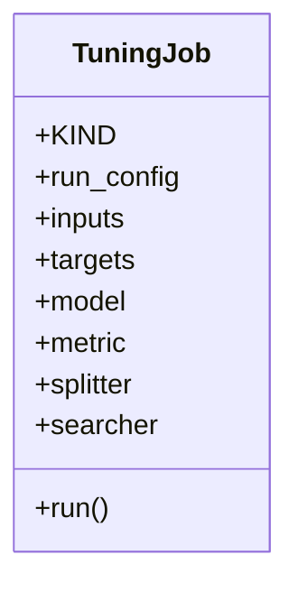
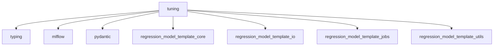

# tuning

Source File: `src/regression_model_template/jobs/tuning.py`

Define a job for finding the best hyperparameters for a model.

```mermaid
classDiagram
    class TuningJob {
        +KIND
        +run_config
        +inputs
        +targets
        +model
        +metric
        +splitter
        +searcher
        +run()
    }
```

```mermaid
flowchart TD
    tuning --> typing
    tuning --> mlflow
    tuning --> pydantic
    tuning --> regression_model_template_core
    tuning --> regression_model_template_io
    tuning --> regression_model_template_jobs
    tuning --> regression_model_template_utils
```
